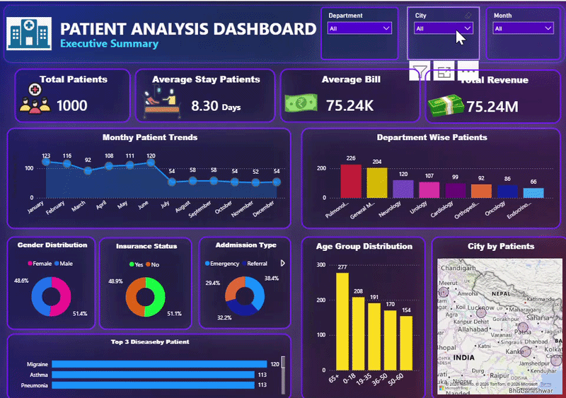

# Hospital Patient Analysis Dashboard | Healthcare Operations & Revenue Intelligence
**Power BI · Power Query · DAX**

---

## Executive Snapshot (3-Minute Read)

**Business Context**
A multi-city hospital network needed visibility into where patient load, revenue, and care demand were concentrated across departments, age groups, and geographies. Leadership wanted to know not just "how many patients" but *which departments are overloaded, which patient segments dominate demand, and where admission patterns are shifting* — before capacity and staffing decisions were made blind.

### Dashboard Walkthrough

## Key Findings
- Pulmonology and General Medicine together handle **43% of all patient volume** (430 of 1,000) — the two departments are effectively running the hospital's load
- Admissions **fall by more than half after June** — from ~110-123 patients/month (Jan-Jun) to a flat ~54/month (Jul-Dec) — a seasonal pattern, not random noise
- The **65+ age group is the single largest patient segment** (277 patients), just ahead of 0-18 (208) — the hospital is serving two structurally different patient populations, not one
- **Referral admissions (38.4%) outnumber Emergency (29.4%)** — inflow is driven more by other providers referring patients in than by walk-in emergencies
- Nearly **half of all patients (51.1%) carry no insurance** — a material revenue-risk segment sitting almost 50/50 with insured patients

**Why This Matters**
A hospital dashboard that only reports totals hides where the real pressure is. This analysis breaks the same 1,000-patient base down by department, time, age, admission channel, and geography to show *where* capacity is strained and *who* the hospital is actually serving — not just how many patients came through the door.

## Actionable Recommendations
- Reallocate nursing/bed capacity toward Pulmonology and General Medicine, which jointly absorb 43% of patient load
- Investigate the Jan-Jun vs Jul-Dec admission gap — if seasonal (e.g. respiratory season), pre-staff Pulmonology ahead of peak months
- Build distinct care pathways for the 65+ and 0-18 segments — different equipment, staffing ratios, and average stay expectations apply to each
- Strengthen referral-network relationships given Referral is the leading admission channel, not Emergency
- Launch an insurance outreach or payment-plan program targeting the ~51% uninsured segment to reduce collection risk

> *Note: Patient names and identifiers in this dataset are synthetic/sample data used for demonstration purposes.*

---

## 📌 Project Overview

This project delivers an end-to-end Power BI analysis of hospital patient data — covering data import, cleaning, modeling, and dashboard design.

The business question: *"How can hospital administrators use patient admission data to optimize department staffing, understand patient demographics, and identify revenue and capacity risks?"*

As the analyst on this project, the focus was on three goals — identifying department-level load imbalance, understanding who the patient base actually is (age, gender, insurance), and surfacing admission and seasonal patterns that raw totals alone don't reveal.

---

## 📊 Executive Summary

### Dashboard Overview

### Volume & Cost
- Total Patients: **1,000**
- Average Stay Duration: **8.30 days**
- Average Bill: **₹75.24K**
- Total Revenue: **₹75.24M**

Implication: At an average 8.3-day stay, bed turnover is a meaningful constraint — department-level load (see below) matters more than the hospital-wide average suggests.

---

### Department Load
| Department | Patients | Share |
|---|---|---|
| Pulmonology | 226 | 22.6% |
| General Medicine | 204 | 20.4% |
| Neurology | 120 | 12.0% |
| Urology | 107 | 10.7% |
| Cardiology | 99 | 9.9% |
| Orthopedics | 92 | 9.2% |
| Oncology | 86 | 8.6% |
| Endocrinology | 66 | 6.6% |

- **Top 2 departments carry 43% of total patient volume** — the remaining 6 departments split the other 57%
- This is not an even 8-way split — capacity planning needs to reflect that imbalance directly

Implication: Staffing models built on hospital-wide averages will understaff Pulmonology and General Medicine and overstaff the smaller departments.

---

### Admission Patterns
- **Monthly trend shows a clear H1/H2 split**: Jan-Jun averages ~110/month, Jul-Dec flattens to ~54/month
- **Referral (38.4%)** is the leading admission type, ahead of **Emergency (29.4%)**
- The remaining admissions split across other categories (e.g. OPD/Elective)

Implication: The hospital's patient pipeline depends more on external referral relationships than on emergency walk-ins — referral network health is a growth lever, not just a pass-through channel.

---

### Patient Demographics
- Gender split is nearly balanced: **51.4% Male / 48.6% Female**
- Age distribution is bimodal, not centered: **65+ (277) and 0-18 (208)** are the two largest groups, with 19-35 (191), 36-50 (170), and 50-60 (154) filling the middle
- Insurance is close to a coin flip: **48.9% Yes / 51.1% No**

Implication: "Average patient" is a misleading concept here — the hospital serves two distinct demand curves (elderly + pediatric) that likely need different clinical protocols, not one blended standard of care.

---

### Geography & Disease Mix
- **City-wise map** shows patient concentration led by Kolkata, followed by Ranchi, Patna, Delhi, and Lucknow — demand is regionally concentrated, not evenly spread nationally
- **Top 3 diagnosed conditions**: Migraine, Asthma, and Pneumonia — each in the 110-120 patient range

Implication: Medicine stock and preventive-care outreach should be weighted toward respiratory and neurological conditions, and regional supply chains should prioritize the top 5 cities.

---

## 🔍 Insights Deep Dive

### Department & Capacity
- **Pulmonology (226) is the single largest department** — nearly 2x the size of the 3rd-ranked Neurology (120)
- **Endocrinology is the smallest department (66 patients)** — a 3.4x gap between the largest and smallest department by volume

### Seasonality
- **H1 (Jan-Jun) admissions run roughly double H2 (Jul-Dec)** on a monthly basis — this is too consistent across six straight months to be random variation, and warrants a root-cause check (seasonal illness patterns, referral timing, or a data-collection artifact)

### Demographics & Insurance
- The **65+ and 0-18 groups together make up 48.5%** of the entire patient base — essentially half the hospital's patients sit at the two ends of the age spectrum
- **Uninsured patients (51.1%) are the majority**, not the minority — insurance outreach isn't a niche program opportunity, it's a majority-of-patients opportunity

---

## ✅ Recommendations

### Short-Term (Capacity & Staffing)
- Shift nursing and bed allocation toward Pulmonology and General Medicine based on the 43% combined load
- Cross-train staff to flex between high-volume and low-volume departments given the 3.4x gap between Pulmonology and Endocrinology

### Medium-Term (Referral & Revenue)
- Formalize and strengthen relationships with referring providers, since Referral (38.4%) outpaces Emergency (29.4%) as the top admission channel
- Design a targeted insurance enrollment or flexible payment program for the ~51% uninsured segment

### Long-Term (Seasonal & Demographic Planning)
- Investigate the H1/H2 admission drop with a root-cause analysis before the next Jan-Jun cycle, to pre-position staff and beds if the pattern is seasonal
- Build separate care-pathway standards for the 65+ and 0-18 populations rather than one blended protocol, given they jointly make up nearly half the patient base

---

## 🛠️ Tools & Techniques

`Power BI` · `Power Query` · `DAX` · `Data Modeling & Relationships` · `Data Cleaning & Transformation` · `Interactive Slicers & Cross-Filtering` · `Map Visualization` · `Dashboard Design`

---

## ⚠️ Assumptions & Caveats

- Dataset is a sample/synthetic hospital dataset used for portfolio demonstration purposes
- Department-level averages (bill, stay) are computed across the full patient population and may mask sub-segment variation (e.g. by admission type or age group)
- Seasonal admission pattern is observational — a definitive cause (illness season, referral cycle, data collection window) was not independently verified against external data

---

## 📂 Project Files

- `Patient_Analysis_Dashboard.pbix` — Full Power BI report file
- `Screenshot 2026-07-31 014634.png` — Dashboard preview
- `patientDashboardemo.gif` — Interactive demo walkthrough

## ▶️ How to View

1. Download `Patient_Analysis_Dashboard.pbix`
2. Open in [Power BI Desktop](https://www.microsoft.com/en-us/power-platform/products/power-bi/downloads) (free)
3. Use the Department, City, and Month slicers to explore the data interactively

---

## 📬 Contact and Feedback

This project was developed as part of a portfolio demonstrating end-to-end data analysis and dashboard design capabilities using Power BI.

**Data Analyst:** Sanju Rohilla

**LinkedIn:** [Profile](https://www.linkedin.com/in/sanju-rohilla-4450452a5)

**GitHub:** [SanjuRohilla](https://github.com/SanjuRohilla)

**Email:** sanjurohillla2022@gmail.com

---

*Data Source: Simulated hospital patient dataset | Tools: Power BI · Power Query · DAX*
